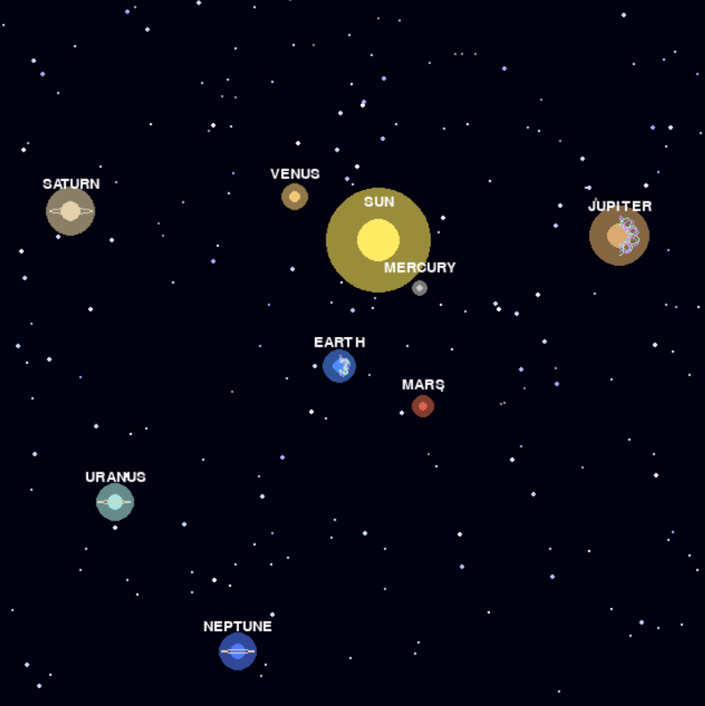

🌍 **Solar System Simulation with Python | Interactive 3D Graphics**

Welcome to AirSpace! In this video, I show you a complete interactive Solar System simulation built entirely with Python and Pygame. You can explore all 8 planets, zoom in and out, fly through space, and even trigger a supernova.

🚀 **This is not a pre-rendered animation. This is real-time Python code running on my computer.**

---

🎮 **Features You Will See:**

- ☀️ Realistic Sun with animated solar flares
- 🪐 All 8 planets orbiting at different speeds
- 🌍 Earth with Aurora Borealis effect
- 💍 Saturn's iconic rings
- 🌙 Moon orbits (press M key)
- 📏 Planet size comparison (press C key)
- ⏰ Time warp – speed up or slow down orbits (press T key)
- 🚀 Free flight mode – fly anywhere with WASD keys (press F key)
- 🌀 Radial menu – jump to any planet instantly (right-click)
- 💥 Supernova easter egg – click the Sun 10 times
- 🌠 Exoplanet systems – TRAPPIST-1, Kepler-186f, Sirius, Proxima Centauri (press ENTER)
- 🥚 Pluto easter egg – type P L U T O on your keyboard

---

📦 **Download the Complete Code:**

🔗 GitHub Repository: https://github.com/linerfan5114/Solar-System-Simulation-with-Python-Interactive-3D-Graphics

⚙️ **Requirements to run:**
- Python 3.7 or higher
- Pygame library

▶️ **How to run the simulation:**
```bash
git clone https://github.com/linerfan5114/Solar-System-Simulation-with-Python-Interactive-3D-Graphics.git
cd Solar-System-Simulation-with-Python-Interactive-3D-Graphics
pip install pygame
python system-simulation.py
```



🎗️ **YouTube & Telegram:**

YouTube : https://www.youtube.com/@airspacecode

Telegram: https://t.me/airspacecode
